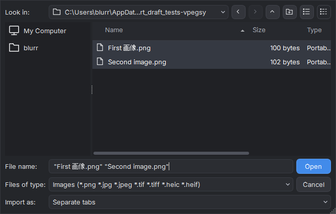

# Using Compositor on Windows

This Windows 11 x64 preview opens and edits layered images locally. It is an independent preview targeting Compositor 1.2.11 by Robbie Tilton, based on the editing/project source at `0ecbacfff8610b566eda059fb2644fddf337fb65`. See the release notes for supported workflows and measured limitations.

## Start a project

In an installed build, use the Start menu shortcut. In a portable build, open `Compositor.exe`. Choose **File > New Canvas** to enter canvas dimensions, or **File > Import Image** to import PNG, JPEG, TIFF, HEIC, SVG, Photoshop PSD/PSB, or supported camera RAW files. Use **Import as** in the picker to open each selected image in a separate tab (the default), or add all selected images as **Layers in current project**. Each project has its own tab, layer selection and tool settings. The Layers panel selects the image or mask you are editing.

Finish or cancel an active edit before opening separate tabs. During an edit that prevents switching projects, the picker offers import into the current project's layers.

<!-- Native Windows capture at 100% scaling, using the generated two-image import regression fixture. -->

Use **File > Open Project** for a saved `.comp` project. A `.comp` project is a directory containing its manifest and image assets. Copy or back up the complete directory. Save with **Ctrl+S**, or use **Save Project As** to make a separate project. An asterisk in the tab indicates unsaved changes. Closing a modified project offers Save, Discard or Cancel.

## Import Photoshop, SVG and camera RAW files

Photoshop imports support **8-bit RGB PSD and PSB** files, including uncompressed, RLE, ZIP and ZIP prediction channels. Imported layers retain visibility, opacity, supported blend modes, folders, clipping bases and placed masks. Importing into an existing project puts the Photoshop layers in a new folder, centered on the canvas or drop point.

Supported uniform horizontal Photoshop text remains editable, including paragraph boxes, spacing, alignment, rotation and vertical flips. Vertical text, shear and uneven text scaling use Photoshop's saved raster appearance. Mixed styles use the first style. Missing fonts can change text appearance on Windows. Supported filled rectangles, rounded rectangles with equal corner radii, and ellipses become editable shapes. Other vector shapes use their pixel appearance, or are rasterized when a supported vector path and fill/stroke are available.

Read the **Photoshop Conversion** details after import. They identify discarded Photoshop layer effects, omitted vector strokes, rasterized smart objects, text substitutions, unsupported blend modes and skipped adjustments. Photoshop Levels, Curves and Hue/Saturation become editable adjustments; their parameters may render differently. When oversized layer storage exceeds the import budget, layers are cropped to the Photoshop canvas and the omitted outer pixels are reported. Keep the source PSD/PSB when you need those pixels or unsupported Photoshop features.

SVG is rendered to an image layer using Qt SVG. On an existing canvas, its proportions are fitted to that canvas; in a new project it uses the SVG's declared dimensions. The imported layer is editable as pixels. External files, external stylesheets and document type declarations are rejected; embed bitmap images as base64 data in the SVG.

Camera RAW opens **Develop Camera RAW** before import. Adjust Exposure, Temperature, Tint and Tone boost, inspect the preview, then choose **Develop and Import**. **Use camera white balance** uses the recorded camera multipliers. The Kelvin value is an estimated starting point; changing Temperature or Tint switches to manual balance. **Reset to As Shot** restores the starting settings. Cancel imports no pixels. Development uses bundled LibRaw offline and produces an sRGB image layer at full resolution. Supported camera models depend on LibRaw 0.21.5; the optional lossy JPEG-compressed DNG decoder is not included. Windows RAW development uses LibRaw's color and tone response, so it can differ from Apple's RAW development.

## Window appearance

Windows title bars and system controls are the default. Turn on **View > Appearance > Mac-style title bar** for colored controls on the left; turn it off to restore the native Windows title bar. The choice applies immediately to the editor and dialogs and is remembered between launches. Progress windows always use native Windows title bars so their progress and Cancel controls stay visible. It changes only the window chrome; the editor's visual design stays the same.

## Navigate and arrange layers

Use **Ctrl+0** to fit the canvas and **Ctrl+1** for actual pixels. Hold **Space** and drag to pan. The mouse wheel pans; Ctrl or Alt with the wheel zooms around the pointer. Pixel Grid is available in the View menu and appears at high zoom.

Select a layer in the Layers panel. Use its visibility control to hide or show it, and the blend and opacity controls to change its appearance. The Layer menu contains duplication, grouping, ordering, clipping and merge operations. A mask thumbnail selects mask editing; select the image thumbnail to return to the image. Mask operations are in the Mask menu. Painting white reveals coverage and painting black hides it.

The **Move** tool moves selected layers. Transform handles scale and rotate them; the Transform panel accepts numeric position, size and angle. Ordinary layer transforms preserve source pixels. A free-distortion draft has Apply and Cancel actions and resamples on Apply. **Escape** cancels an active operation; **Ctrl+Z** undoes a committed change.

## Select, paint and draw

Marquee, Lasso, Polygon and Wand create selections. Shift adds and Alt subtracts. Polygon closes when you click near its first point, double-click, or press Enter; Backspace removes its most recent corner. With a selection tool active in New selection mode, dragging inside a selection moves its outline. With a selection tool active, Ctrl-drag moves selected image pixels; Ctrl+Alt-drag duplicates them. Arrow keys move by one pixel and Shift+arrow by ten.

Brush and Eraser use the current tip controls. Clone, Heal and Retouch expose their own options in the upper toolbar. Select a mask before using the same painting tools to edit coverage. The Foreground and Background controls open the color palette; **X** swaps them and **D** restores defaults. Editing is disabled when the target is hidden, incompatible with the tool, or waiting for another operation.

Gradient keeps a pending preview until Apply. Cancel or Escape discards it. Shape creates rectangles, ellipses or lines with editable style; Shift+U or Tab switches the shape kind. Line width controls its thickness, and Shift constrains its angle. Crop has an explicit Apply action. Image and Canvas commands change the image dimensions, canvas bounds or resolution; check the selected anchor and units before applying.

Each project remembers its Freehand/Polygonal lasso choice and separate Expand/Contract amounts. **L** returns to the remembered lasso kind. Crop offers Free, Original, 1:1, 4:3, 3:4, 16:9 and 9:16 ratios; starting a fresh crop resets the choice to Free.

## Text, effects and layout

Select **Type (T)** and click to create point text, or drag a paragraph box. The text panel provides font family/face, size, color, alignment, tracking, line spacing and wrapping bounds, with a live canvas preview. **Ctrl+Enter** applies one document edit; **Escape** cancels. Undo within the text field edits typing before commit. Double-click a text layer to edit again. Missing fonts retain the saved pixels until edited, when Windows uses a fallback font. Painting and other destructive source edits rasterize text; ordinary transforms and masks retain it.

The Layers panel offers all 24 blend modes and folder opacity. **Image > Adjustments > Layer Effects** edits Stroke, Drop Shadow, Color Overlay, Inner Shadow, Outer Glow and Inner Glow. Each effect can remain stored while disabled. Preview, Apply, Cancel, undo, duplication and project saves retain their parameters.

Use **View > Rulers** to show pixel rulers. Drag from a ruler to create a guide, drag a guide to move it, or drag it back onto a ruler to delete it. **New Guide**, **Lock Guides** and **Clear Guides** are also available. Guides belong to the project; grid/ruler visibility and **Snap To** choices are saved application preferences. The layout grid has 64-pixel major lines and 8-pixel subdivisions. Hidden guides or grid lines do not attract snapping. **Image > Trim** removes transparent or matching corner-color margins, with independently chosen sides.

## Selection and input

**W** selects the Magic tool. Choose **Object** or press Tab to switch from Wand, then click the object to select. Object selection runs the bundled SlimSAM model offline and uses the clicked point to distinguish instances. **Select > Select Subject** finds the foreground with the bundled foreground model. Sample All Layers chooses between the active layer and visible composite. Edge offset shrinks or grows object bounds. Model results can need manual refinement.

Shift adds to a selection; Alt, including Shift+Alt, subtracts. The options-bar choice applies when neither is held. **Select > Feather** softens both sides of the outline; repeated feathering accumulates to 250 pixels. Brush **Smoothing** steadies pointer movement while retaining the stroke endpoint. Masks can be painted across the canvas, growing their stored bounds without changing the image layer's transform.

Drag numeric labels to adjust values; Shift increases the rate and Alt makes finer changes. **Edit > Keyboard Shortcuts** remaps menu and canvas commands, detects conflicting assignments and restores defaults. Text fields retain normal typing shortcuts. Space-drag or the middle mouse button pans the canvas; Ctrl+= and Ctrl+- zoom.

## Adjust an image

Image > Adjustments and the Filters menu provide color and tonal adjustments, blur, noise, lens correction and content-aware fill. Select an image layer first; a selection restricts applicable pixel edits. Inspect the preview, then Apply to commit one undoable change or Cancel to discard it. Adjustment-layer commands keep editable adjustment parameters in the layer stack.

Filter dialogs reopen the choices last used with Apply, including Curves, Exposure, Grain and background-removal controls. Cancel preserves the previously remembered choices, and each project keeps its own values. A new Gradient Map always starts from the current foreground and background colors. Live adjustment layers retain their own parameters.

Choose **Filters > Camera Raw** for a rendered image layer. Its ten sections cover Light, Color, Effects, Curve, Mixer, Grading, Detail, Optics, Geometry and Calibration. Apply commits the result as one undoable pixel edit, with existing masks, effects, clipping and transforms retained. A selection limits the pixels changed. Cancel discards the preview. Applied Camera Raw settings are remembered for the next use.

Use the section checkbox to compare a group of adjustments, or turn off **Preview** to see the original. The scope selector switches between the RGB histogram and vectorscope. Shadow/Highlight clipping overlays are preview aids. Hold **Alt** while dragging Light sliders to inspect clipped channels, or Sharpening masking to inspect its coverage. Drag a slider label to scrub its value; double-click a label or slider to restore its default. The mouse wheel zooms the image preview.

The preview tool selector offers white-balance and point-color eyedroppers, guided geometry, and targeted adjustments. For point color, click a color, then adjust its hue, saturation, luminance and range in Mixer. For guided geometry, drag a line along an edge that should be straight; up to four guides are retained. Targeted tone adjusts the curve region under the pointer. Targeted color changes the sampled color family's saturation; hold Ctrl for hue or Shift for luminance while dragging. Curve points can be added and dragged; double-click an interior point to remove it. Grading wheels control hue and saturation, with luminance and blending controls below. Optics offers generic lens correction strengths for rendered layers.

Remove Background runs the bundled model offline. Basic uses its initial mask; Advanced exposes refinement, edge shift and contrast. Applying creates or updates an undoable layer mask. Inspect fine edges before accepting the result. Fine hair and fur can retain source-background colors, and transparent objects such as soap bubbles can lose their appearance. Advanced refinement is not always an improvement. A no-subject result leaves the image unchanged; textured backgrounds can be ambiguous. Use the mask painting tools for cleanup.

## Export and exchange files

Choose **File > Export Image** for PNG or JPEG. PNG retains transparency. JPEG uses the selected matte and quality. Wait for the encoded preview to finish; Save writes those prepared bytes. Cancel leaves an existing destination unchanged. Export supports at most 30,000 pixels on either side and 200 million pixels in total; larger editing canvases can require resizing before export.

Project Save preserves layers, masks and editable metadata. Export creates a flattened image for other applications. With a pixel selection, Copy/Cut use the selected target and Copy Merged uses the visible composite. Without a selection, Copy and Paste preserve complete layers, folders, effects, text and supported metadata within Compositor. Copied layer data is captured immediately and survives source edits or closing its tab. External applications receive the image fallback. Duplicate supports folders and multiple selected layers as one undoable operation.

The Windows reader implements project versions 1–9 and writes version 9. Format 10/11 text runs require the subsequent integration. Actual Mac-generated compatibility fixtures have not yet been supplied. Keep an original copy when testing project exchange with the Mac application.

## Common shortcuts

Shortcuts apply to the editor when a text field or dialog is not using the keys.

| Action | Shortcut |
|---|---|
| New / Open / Save | Ctrl+N / Ctrl+O / Ctrl+S |
| Save As / Export | Ctrl+Shift+S / Ctrl+Shift+E |
| Close project | Ctrl+W |
| Undo / Redo | Ctrl+Z / Ctrl+Shift+Z |
| Cut / Copy / Paste | Ctrl+X / Ctrl+C / Ctrl+V |
| Fit / Actual pixels | Ctrl+0 / Ctrl+1 |
| Move / Hand | V / H |
| Marquee / Lasso / Wand | M / L / W |
| Brush / Eraser | B / E |
| Clone / Heal / Retouch | S / J / R |
| Gradient / Shape / Crop | G / U / C |
| Eyedropper / Zoom | I / Z |
| Temporary pan | Hold Space and drag |
| Foreground/background swap / defaults | X / D |
| Cancel a pending gesture | Escape |

Menu items show additional shortcuts and current availability. Preview updates are manual: install the next MSI, or extract the next portable download into a separate folder. Keep projects outside the application folder and back up each complete `.comp` directory. Automatic updates are disabled in this preview.
